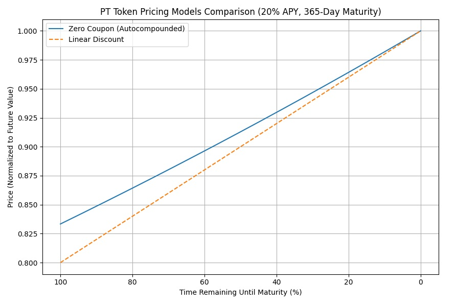

## Spectra PT oracle deployer

**This projects tests deploying a Spectra PT oracle and provides the deploy script to do it.**

## Usage

### Configure

Create a .env file by copying the .env.example file and filling in the values.

#### Network
RPC_URL="https://mainnet.base.org"
PRIVATE_KEY="your_private_key_here" # No '0x' prefix needed

The RPC_URL should be the RPC URL of the network you want to deploy to. The PRIVATE_KEY should be the private key of the account you want to deploy from.
PRIVATE_KEY does not need to be set for testing.

#### Contract Addresses
PT_ADDRESS="0x95590E979A72B6b04D829806E8F29aa909eD3a86"
POOL_ADDRESS="0x39E6Af30ea89034D1BdD2d1CfbA88cAF8464Fa65"
ORACLE_FACTORY_ADDRESS="0xAA055F599f698E5334078F4921600Bd16CceD561"
ZCB_MODEL_ADDRESS="0xf0DB3482c20Fc6E124D5B5C60BdF30BD13EC87aE"

ORACLE_FACTORY_ADDRESS and ZCB_MODEL_ADDRESS do not need to be changed if you are on Base.
The PT and POOL addresses need to belong together.

#### Oracle Parameters
INITIAL_IMPLIED_APY="1000000000000000000" # 1.0 in 18 decimals
ORACLE_OWNER="0x..." # Address that will own the oracle
The owner can change pricing models so this address should be secure. Preferably a multi-sig.

INITIAL_IMPLIED_APY will be used by the oracle for the price calculation so it is extremely important to get it right.
The tests are meant to help you determine this.
By running the tests in verbose mode (forge test -vv) you should be able to see an output that gives you the value.

The test will output for example: Implied APY (raw): 69808386674793900
And this is the value to be used when deploying the oracle.
However be sure to make sure that all the values in the test make sense, especially APY and prices.

### Build

```shell
$ forge build
```

### Test

```shell
$ forge test -vv
```
-vv is for verbose mode which is necessary to see the console.log output.

### Example output
Compiler run successful!

Ran 2 tests for test/SpectraOracleDeployer.t.sol:SpectraOracleDeployerTest
[PASS] test_DeployOracle() (gas: 989046)
Logs:

  IBT/PT Curve Price (raw): 789089821686806454
  
  IBT/PT Curve Price (decimal): 0.78908
  
  Underlying Price (raw): 974690889278392461
  
  Underlying Price (decimal): 0.97469
  
  Time to Maturity in years (raw): 362551147894469812
  
  Time to Maturity in years (decimal): 0.36255
  
  Discount (raw): 25309110721607539
  
  Discount (%): 2.53%
  
  Implied APY (raw): 69808386674793900
  
  Implied APY (%): 6.98%
  
  Oracle deployed at: 0xc4B280E3ea28a711C62AC7f98b3Eb4C4Feba6Ea6
  
  Initial oracle price: 975831

[PASS] test_VerifyPT() (gas: 45295)
Logs:

  IBT address: 0x90613e167D42CA420942082157B42AF6fc6a8087
  
  Underlying token address: 0x833589fCD6eDb6E08f4c7C32D4f71b54bdA02913
  
  PT maturity timestamp: 1755648010
  
  PT symbol: PT-fUSDC-1755648010

Suite result: ok. 2 passed; 0 failed; 0 skipped; finished in 7.21s (8.47s CPU time)

Ran 1 test suite in 7.21s (7.21s CPU time): 2 tests passed, 0 failed, 0 skipped (2 total tests)

### Deploy

```shell
forge script script/DeployOracle.s.sol:DeployOracleScript --rpc-url $RPC_URL --private-key $PRIVATE_KEY -vvv
```

## Discount Model Selection

### Zero Coupon Bond Model - currently selected

✓ Follows standard bond pricing mathematics

✓ Accounts for compound interest

✓ Accurate for all PT durations

✗ Higher computational complexity

✗ Higher gas costs

### Linear Discount Model

✓ Simple calculations

✓ Lower gas costs

✓ Easy to understand

✗ Ignores compound interest

✗ Inaccurate for longer durations

✗ Can produce negative prices

### Why Zero Coupon?

- Mathematically correct pricing prevents arbitrage
  
- Works consistently across all time periods
  
- Aligns with traditional finance markets

- The gas on Base and other L2s is cheap so well worth it

### Visualizing the models
You can run the zcb_vs_linear.py script using:
```shell
python zcb_vs_linear.py
```
Using different values for:

APY_PERCENT = 20  # 10% APY

MATURITY_DAYS = 365  # 1-year maturity

It will show the models diverge (because of compounding) with higher interest rates and durations.



## Initial APY Calculation

The initial APY is derived from the Curve pool price using these steps:

1. Get IBT/PT price from Curve pool's `last_prices()`
2. Convert to underlying price using IBT's `previewRedeem`
3. Calculate discount = 1 - currentPrice
4. Calculate APY = discount / timeToMaturityInYears

### Why this approach?
- Uses market price from Curve pool as source of truth
- Accounts for actual trading activity and market sentiment
- Simple to verify and reproduce
- For PT-fUSDC matches the current prices and APYs

